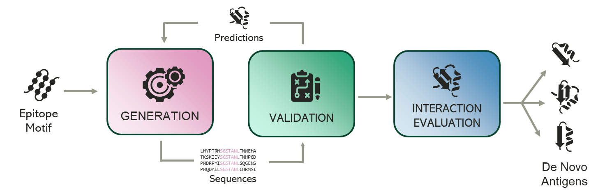

# DA4ViD Pipeline

This repository stores the Python source code implementing the workflow for the _DA4ViD_ Project, whose main aim is to
define an automated pipeline for generating _de-novo_ antigens by epitope scaffolding.

**This is a preliminary version showing components and modules used to implement the pipeline.**



The pipeline starts with an epitope motif and generates several candidate amino-acidic sequences for the antigen.
These sequence are then validated in order to assess the confidence of their folding, filtering the best candidate.
This generation/validation process is iteratively repeated until a high confidence level of folding prevision is
achieved.

Eventually, the best de-novo antigens among all iterations are fed to a module to evaluate the probability of their
interactions and to have an approximation of their likelihood to elicit an immune response.

The pipeline leverages several state-of-the-art AI models to generate candidate sequences, to validate them and to
evaluate interactions. As these models requires different environments and libraries, _Docker containers_
([https://docs.docker.com/get-started/get-docker](https://docs.docker.com/get-started/get-docker)) have been
employed in the pipeline, to ensure isolation and robustness.

## Package Overview

The `da4vid` package contains several sub-modules:

- `model`: defines the domain objects, as `Protein`s, which abstract the core data.
- `docker`: contains the wrappers around containers and provides a set of classes to extend for creating new
  containers.
- io`: manages the I/O operation from different file formats produced by pipeline steps to model objects.
- `metrics`: defines different metrics to evaluate information needed in the filtering process.
- `filters`: contains the functions used to filter candidate proteins.
- `pipeline`: abstracts the different steps involved in the pipeline, providing flexibility in the pipeline composition. It also defines base classes to extend in
  order to implement new steps in the pipeline.
- `db` **experimental**: will define the set of classes and functions to store data produced by the pipeline in an easily-queryable database.

## Installation and usage
At the moment, the main script for the pipeline execution is still under construction, as the different docker images employed are in phase of publication on _DockerHub_ ([https://hub.docker.com/](https://hub.docker.com/)).
A subset of tests can be however executed.

To install the required libraries, from requirements (it may take some time...):
```bash
pip install -r requirements.txt
```

To execute tests, simply run

```bash
python -m unittest
```

Several test should fail as it is still not possible to download the container images. 


